# FCI Graduation Project

<div>
  
    &nbsp;&nbsp;&nbsp;&nbsp;&nbsp;&nbsp;&nbsp;&nbsp;&nbsp;&nbsp;&nbsp;&nbsp;&nbsp;&nbsp;&nbsp;&nbsp;&nbsp;&nbsp;&nbsp;&nbsp;&nbsp;&nbsp;&nbsp;&nbsp;
    &nbsp;&nbsp;&nbsp;&nbsp;&nbsp;&nbsp;&nbsp;&nbsp;&nbsp;&nbsp;&nbsp;&nbsp;&nbsp;&nbsp;&nbsp;&nbsp;&nbsp;&nbsp;&nbsp;&nbsp;&nbsp;&nbsp;&nbsp;&nbsp;
    &nbsp;&nbsp;&nbsp;&nbsp;&nbsp;&nbsp;&nbsp;&nbsp;&nbsp;&nbsp;&nbsp;&nbsp;&nbsp;&nbsp;&nbsp;&nbsp;&nbsp;&nbsp;&nbsp;&nbsp;&nbsp;&nbsp;&nbsp;&nbsp;
    &nbsp;&nbsp;&nbsp;&nbsp;&nbsp;&nbsp;&nbsp;&nbsp;&nbsp;&nbsp;&nbsp;&nbsp;&nbsp;&nbsp;&nbsp;&nbsp;&nbsp;&nbsp;&nbsp;&nbsp;&nbsp;&nbsp;&nbsp;&nbsp;
    &nbsp;&nbsp;&nbsp;&nbsp;&nbsp;&nbsp;&nbsp;&nbsp;&nbsp;&nbsp;&nbsp;&nbsp;&nbsp;&nbsp;&nbsp;&nbsp;&nbsp;&nbsp;&nbsp;&nbsp;&nbsp;&nbsp;&nbsp;&nbsp;  
  
</div>

# Idea Venture

> A Full-Stack Web Platform Designed to Connect Entrepreneurs and Investors.

# Project Drive

> The project-related documentation, including the presentation and project requirements, is available on the following Google Drive:

<div align="center">
  <a href="https://drive.google.com/drive/folders/1E-aZZg0uSknJszdUJfYIB6OeXNlOxH1N?usp=drive_link">Project Drive Link</a>
</div>

## Overview

IdeaVenture is a platform connecting entrepreneurs with investors, bridging the gap between innovative ideas and funding. It enables entrepreneurs to showcase their projects, gain mentorship, and secure funding while offering investors access to a curated selection of promising opportunities.

## Features

-   Custom Profiles: Dashboards tailored for entrepreneurs and investors.
-   Project Submission: Upload business plans and multimedia content.
-   Investor Discovery: Advanced filters to find aligned projects.
-   Secure Messaging: Built-in communication tools.
-   Analytics: Track performance and activity insights.
-   Regulatory Help: Support for business registration and compliance.

## Team Members

| Name                                                               | Role                |
| ------------------------------------------------------------------ | ------------------- |
| [Mohamed Salem](linkedin.com/in/mohamed-salem149)                  | Front-End Developer |
| [Mohamed Nasr](linkedin.com/in/monasr12)                           | Front-End Developer |
| [Abdelrahman Radwan](linkedin.com/in/abdelrahman-radwan-0b668223a) | System Analyst      |
| [Eman Eid](linkedin.com/in/eman-eied-01620a21a)                    | System Analyst      |
| [Retan Dbour](linkedin.com/in/retan-dbour-466236234)               | UI/UX Designer      |
| [Mohamed Belal](linkedin.com/in/muhammed-belal-b27b14280)          | Back-End Developer  |
| [Karim Sherif](linkedin.com/in/karimsherifff)                      | Back-End Developer  |
| [Mohamed Darwish](linkedin.com/in/mohamed-d-52262a1ba)             | Back-End Developer  |
| [Omar Fayez](linkedin.com/in/omar-fayez-282962202)                 | Back-End Developer  |

## Technologies Used

### Front-End

-   **HTML5**
-   **CSS3**
-   **JavaScript**
-   **Bootstrap**
-   **jQuery**

### Back-End

-   **PHP**
-   **Laravel Framework**
-   **MySQL Database**

### UI & UX

-   **Figma**

### IDE & Version Control

-   **VS Code**
-   **Git**
-   **GitHub**

## Architecture

-   **Client:** A responsive front-end built with HTML5, CSS3, and JavaScript/jQuery for intuitive user interactions.
-   **Server:** A back-end powered by PHP and Laravel, ensuring secure and efficient data handling.
-   **Database:** MySQL for reliable and scalable storage of user, project, and transaction data.
-   **Integration:** Seamless connection between front-end, back-end, and database for smooth operation.

## System Analysis

-   **SWOT Analysis**
-   **UML Diagrams**

## Development Tools

-   **Visual Studio Code**
-   **Git/GitHub**
-   **XAMPP for local server setup.**

## Project Screens

### Landing Page

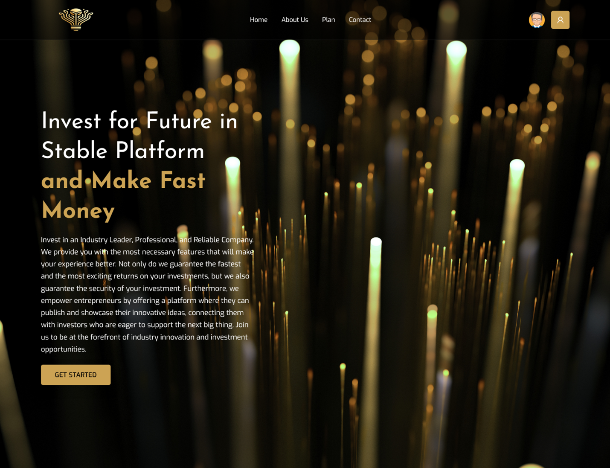

### Registration Page

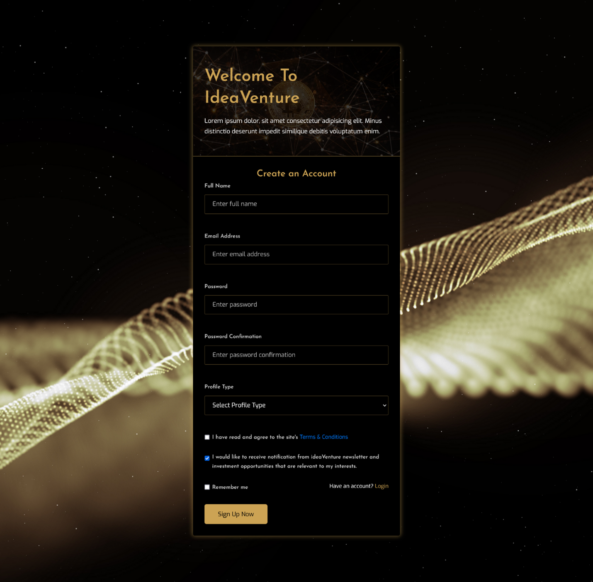

### Login-Page

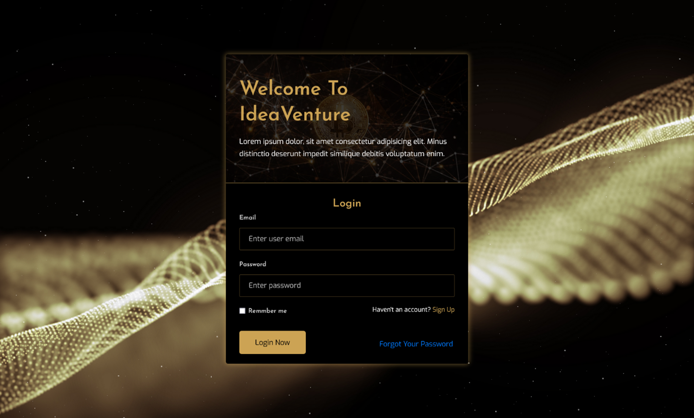

### Entrepreneur Dashboard Page

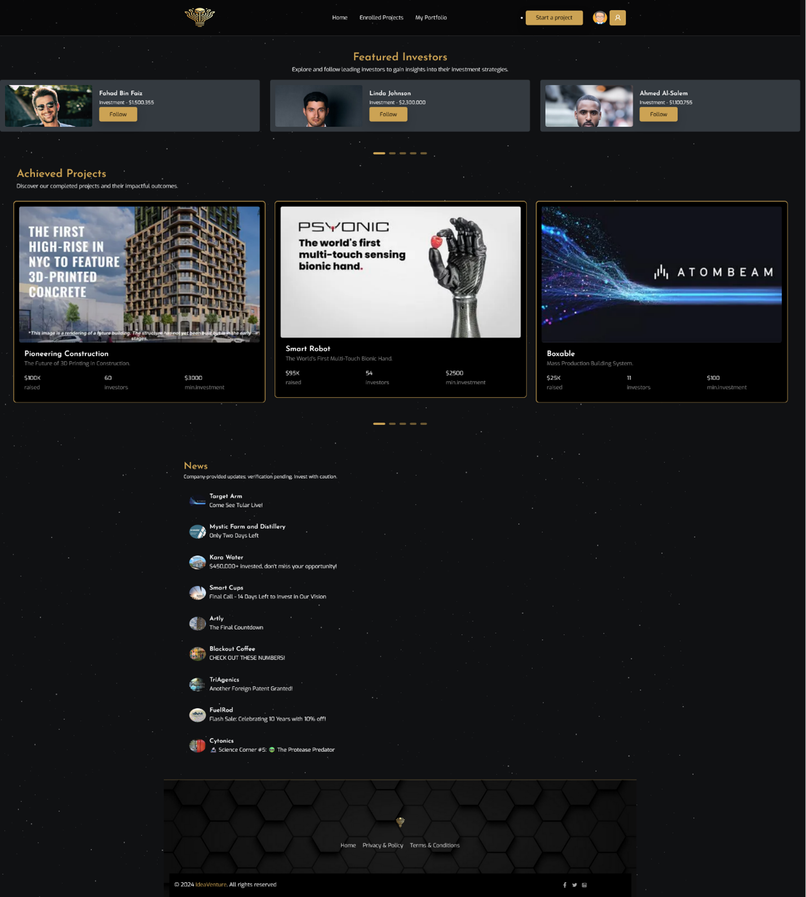

### Create Project Page

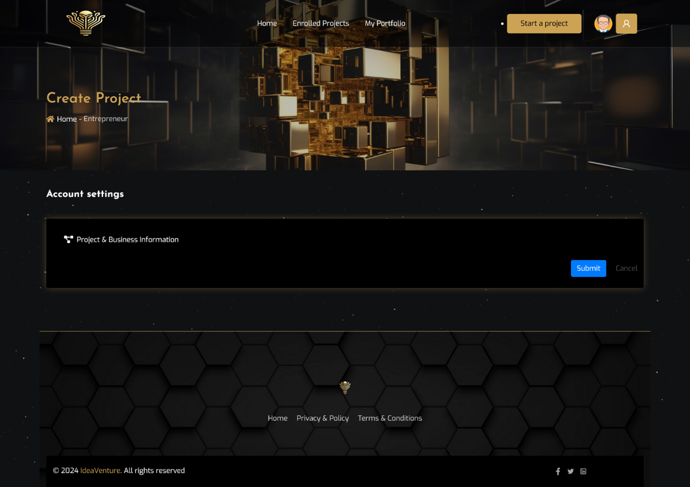

### Enrolled Projects Page

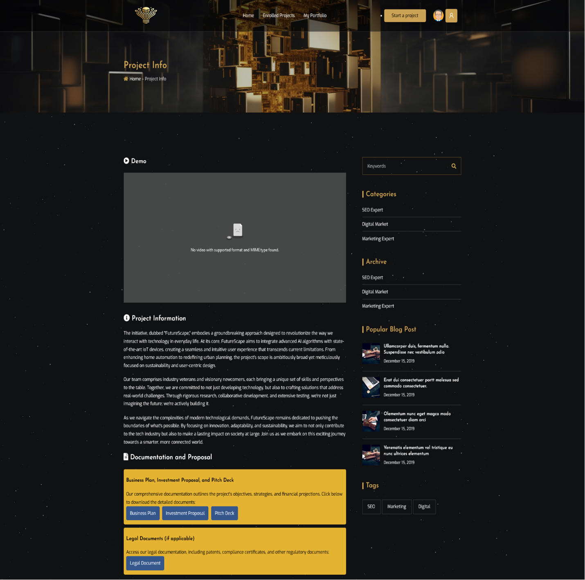

### Entrepreneur Portfolio Page

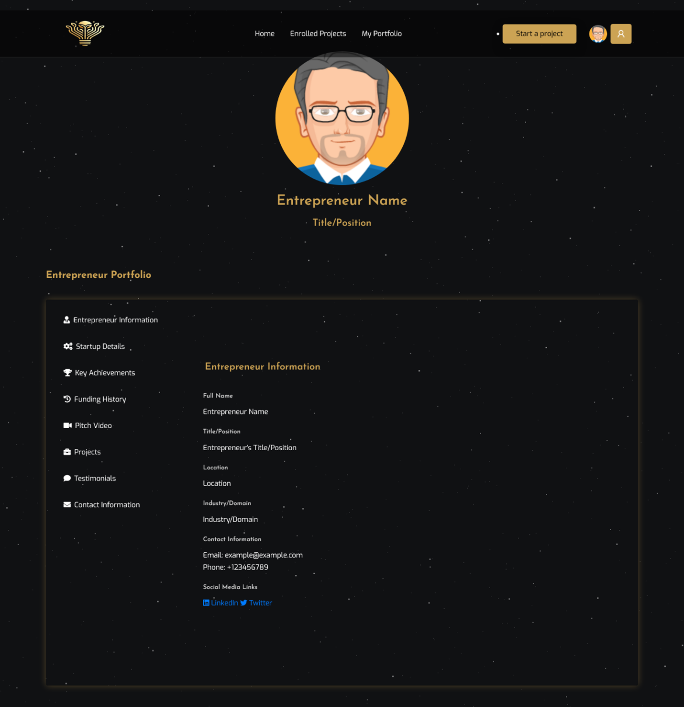

### Settings Page

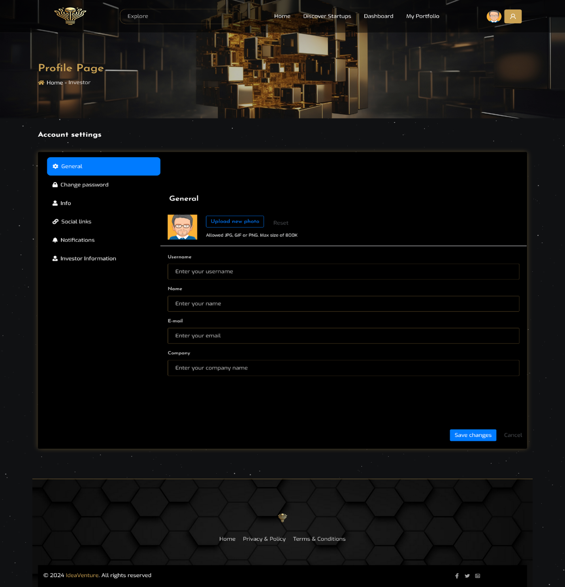

### Investor Dashboard Page

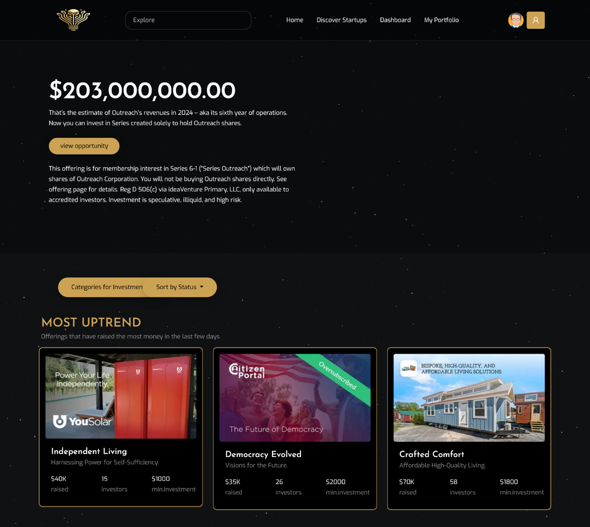

### Investor Portfolio Page

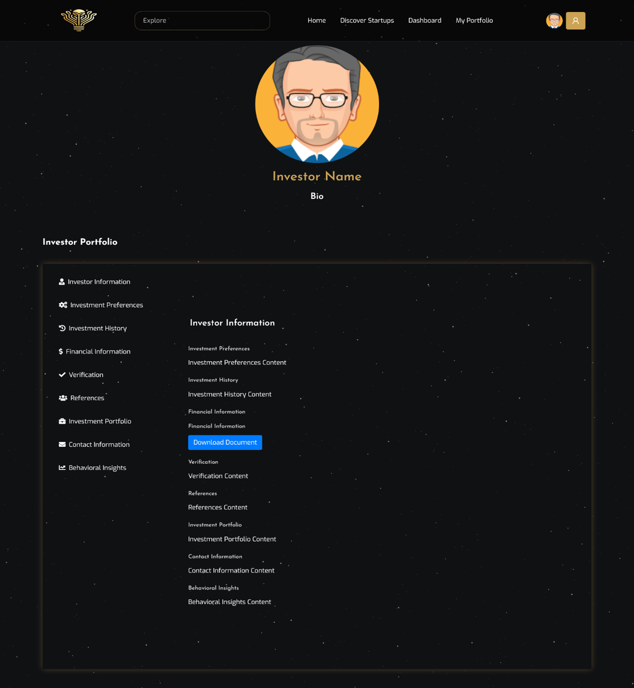

### Discover Startups Page

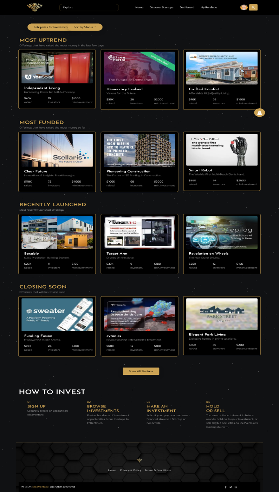

### Investor Wallet Management Dashboard Page

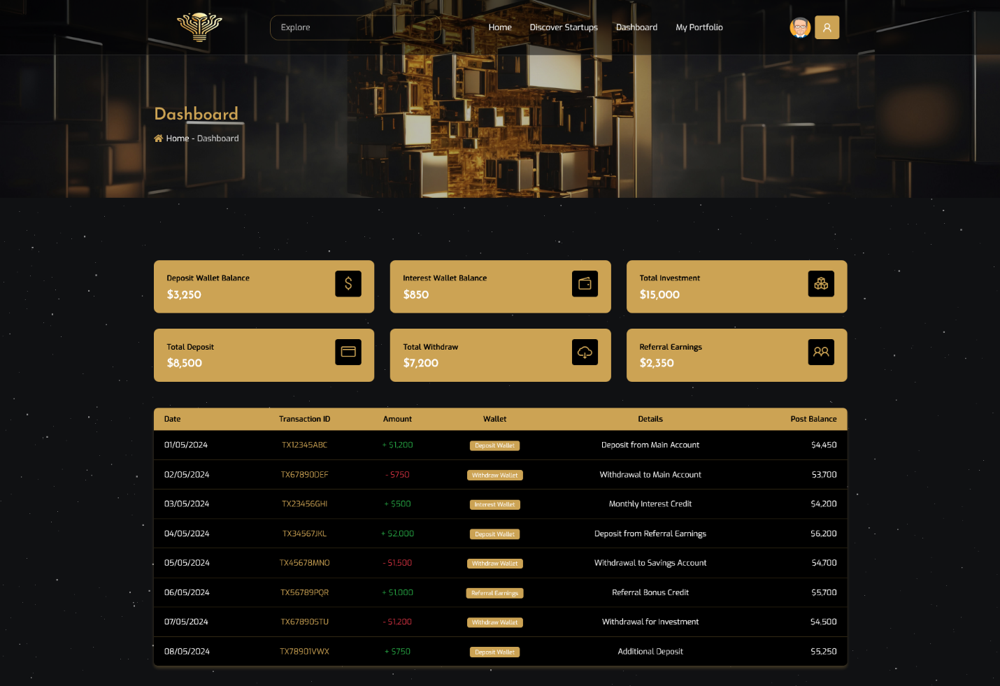

## Getting Started

### Prerequisites

-   PHP
-   Laravel
-   MySQL
-   Composer
-   npm

## Future Enhancements

-   AI-Driven Insights: Implementing machine learning for predictive analytics.
-   Expanded Financial Tools: Integration with banking APIs for secure transactions.
-   Multi-Language Support: Enhancing localization for global outreach.

### Installation

1. Clone the repository:
    ```bash
    git clone https://github.com/IdeaVenture-Team/idea-venture.git
    ```
